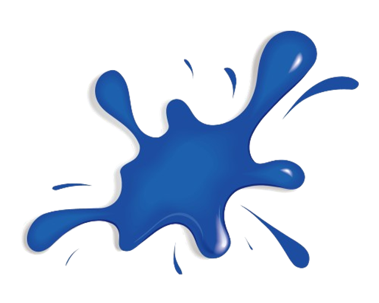

  
  # CG-SLAM: Efficient Dense RGB-D SLAM in a Consistent Uncertainty-aware 3D Gaussian Field
  
  **[Jiarui Hu]()1, [Xianhao Chen]()2,
  [Boyin Feng]()1,
  [Guanglin Li]()1,
  [Liangjing Yang]()2,
  [Hujun Bao]()1
  [Guofeng Zhang]()1
  [Zhaopeng Cui]()1\*** 
  1 State Key Lab of CAD\&CG, Zhejiang University 
  2 ZJU-UIUC Institute, International Campus, Zhejiang University 
  * Corresponding author. 

-----

### [🌐 Project page](https://zju3dv.github.io/cg-slam) | [📝 Paper]() | [📽️ Video]()

  

We presents an efficient dense RGB-D SLAM system, based on a novel uncertainty-aware 3D Gaussian field with high consistency and geometric stability. In our system, we have introduced a comprehensive mathematical theory for the derivatives with respect to pose in the 3D Gaussian splatting framework. Additionally, we have developed a customized GPU-accelerated rasterization pipeline specifically for SLAM, enabling our system to achieve state-of-the-art accuracy and efficiency in various scenarios.

  

**Table of Contents**

- [Update](#Update)
- [Installation](#installation)
- [Usage](#usage)
    - [Run](##downloading-example-datasets)
    - [Evaluation](##training-a-feature-field)
- [Acknowledgement](#Acknowledgement)
- [Citation](#citation)

# Update

- [ ] Code for CG-SLAM

# Installation

# Usage

## Run

## Evaluation

# Acknowledgement

# Citation
